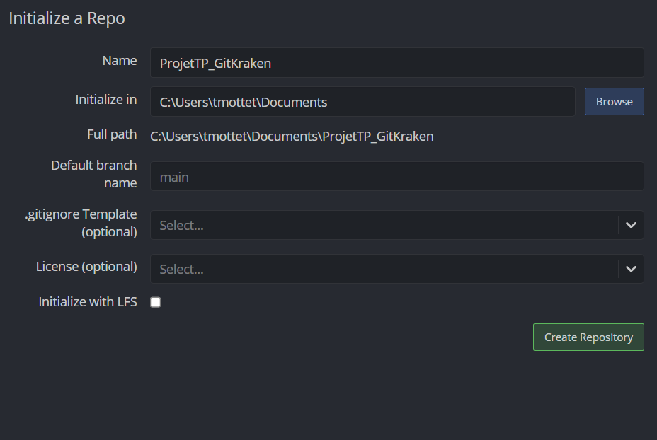
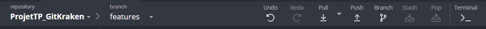

# ProjetTP_GitKraken

## Etape 1 :

### Question n°1 : 

### Question n°2 : 
#### 
#### Name : Choisir le nom du Repository 
#### Initialize in : Choisir l'emplacement ou le Repository sera initialisé
#### Full Path : Le chemin complet du dossier le Repository sera stocké 
#### Default branch name : Le nom de la branche par défaut
#### .gitignore Template (optionnel) : Permet de sélectionner un modèle de fichier .gitignore
#### License (optionnel) : Choix d'une license pour le projet
#### Initialize with LFS (optionnel) : Permet d'initialiser le Repository avec Git Large File Storage
#### Create Repository : Créer le Repository

## Etape 2 : 

### Question n°3 :
#### Isoler les modifications afin de réaliser des tests sans affecter la branche principale

### Question n°4 :
#### Modification de la ligne pour la question 4.
#### 1 : Préparer les modifications
#### 2 : Ajout des fichiers au Staging Area
#### 3 : Rédiger le message de commit
#### 4 : Confirmer le commit
#### 5 : Pousser le commit vers le Repository distant (si nécessaire)

### Question n°5 :
#### Pousser le commit vers le Repository distant permet de collaborer avec son équipe, d'avoir un suivi des versions, une sauvegarde des modifications.

#### 
#### Sélectionner la bonne branche, appuyer sur push et sélectionner le Repository distant et le configurer si besoin

## Etape 3 : 

### Question n°6 : Modification pour faire une erreur
